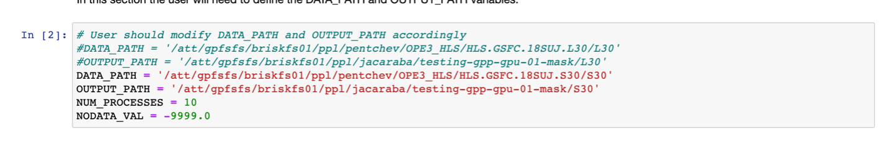
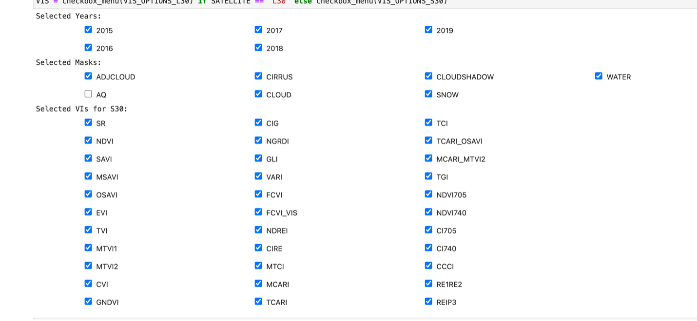
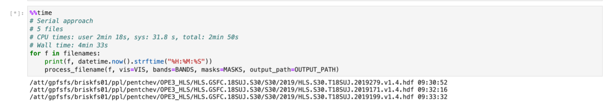

# Innovation Lab Software Task Template – MuSLI Notebook & Kernel

## Overview

This task creates a Python-based Jupyter Notebook to enhance an existing MATLAB
script that calculates vegetation indices (VIs) from extracted spectral values
for the MuSLI project. The enhancement includes the calculation of additional
indices using the Harmonized Landsat and Sentinel-2 (HLS) surface reflectance
dataset and to generate geo-reference products of the VIs.

This notebook is designed to apply to L30 and S30 imagery and will require slight
modifications to apply to additional datasets.

Notebook developed:

- “LANDSAT-SENTINEL-HLS-VIS-GPU.ipynb”: calculation of VIs leveraging GPU resources.

## 1. Define Model

1. Task Objects
    Objects unique to the task that are unlikely to be useful elsewhere.

- LANDSAT-SENTINEL-HLS-VIS-GPU.ipynb

2. Existing Innovation Lab Objects
    Existing lab objects to be reused.

- None

3. New Innovation Lab Objects
    Byproducts of this task that are generally useful to the lab.

- None

## 2. Define View

Define the initial view for this task.  

- None

## 3. Controller

Define the controller for this task.

- None

## 4. Branch Name

N/A (ILAB curator decides)

Note: Currently developed under https://github.com/nasa-cisto-ai/MuSLI,
The production notebook is tagged as v2021.10 on the git repository,
and available as a release.

## 5. Files

1. LANDSAT-SENTINEL-HLS-VIS-GPU.ipynb

## 6. Application Benchmark Configuration

This benchmark configuration depicts a sample invocation of the MuSLI notebook
using ADAPT’s $NOBACKUP storage. Note: The notebook is storage bound since files
are being saved on disk. Faster storage and speed up the process.

### a. Run-time Script

LANDSAT-SENTINEL-HLS-VIS-GPU.ipynb via https://jh-ml.nccs.nasa.gov/jupyterhub-prism

### b. Dependencies

RAM and GPUs:

- Single GPU, variable memory – dependent on the number of processes.
- Single node PRISM resources fulfill the requirement.
  
Software:

- None

Python packages:

- Packages are installed through conda, conda-forge channel. Let the package manager find
the dependencies for CUDA drivers to be compliant.

```bash
conda config --add channels conda-forge
conda config --set channel_priority strict
conda create -y -n hls-vis-gpp rioxarray cupy cudatoolkit=11.2 dask-cuda cudnn cutensor nccl ipykernel ipywidgets matplotlib geopandas iteration_utilities
```

Python dependencies:

```bash
rioxarray >= 0.5.0
cupy >= 9.2.0
cudatoolkit >= 11.2.2
dask-cuda >= 21.8.0
cudnn >= 8.2.1.32
cutensor >= 1.2.2.5
nccl >= 2.10.3.1
ipywidgets >= 7.6.3
matplotlib >= 3.4.2
geopandas >= 0.9.0
iteration_utilities >= 0.11.0
```

### c. Input

- Parameters: configuration variables



- Config variables: checkbox widgets based on the satellite of their choice



- Data: /att/gpfsfs/briskfs01/ppl/pentchev/OPE3_HLS/*/*/*.tif

### d. Sample Invocation



### e. Output

```bash
(hls-vis) [jacaraba@gpu021 2019]$ ls -lth
total 259M
-rw-r----- 1 jacaraba k3003  24M Sep 12 09:35 HLS.S30.T18SUJ.2019156.v1.4.gpp.vis.tif
-rw-r----- 1 jacaraba k3003  55M Sep 12 09:34 HLS.S30.T18SUJ.2019199.v1.4.gpp.vis.tif
-rw-r----- 1 jacaraba k3003 170M Sep 12 09:33 HLS.S30.T18SUJ.2019171.v1.4.gpp.vis.tif
-rw-r----- 1 jacaraba k3003  11M Sep 12 09:32 HLS.S30.T18SUJ.2019279.v1.4.gpp.vis.tif

4 3660x3660 TIFF files ~3 minutes
```

## 7. Container Benchmark Configuration

Does not apply.

### f. Run-time Script

As specified in Section 6.


### g. Dependencies

As specified in Section 6.

### h. Input

As specified in Section 6.

- Parameters:
- Containers:
- Data:


### i. Sample Invocations

As specified in Section 6.

### j. Output

As specified in Section 6.

## 8. Testing

### k. Run-time Script

```bash
tests/testing_hls.sh
```

### l. Dependencies

As specified in Section 6.

### m. Input

Any data product TIF file.

- Parameters:
- Containers:
- Data:

### n. Sample Invocations

```bash
bash testing_hls.bash /att/gpfsfs/briskfs01/ppl/jacaraba/testing-gpp-gpu-01-mask/S30/2019/HLS.S30.T18SUJ.2019124.v1.4.gpp.vis.tif
```

### o. Output

```bash
File checks for Testing (Pass/Fail)
PROJS (WGS 84 / UTM zone 18N): Pass
NODATA (-9999): Pass
COMPRESSION (LZW): Pass
DRIVER (GTiff/GeoTIFF): Pass
```
